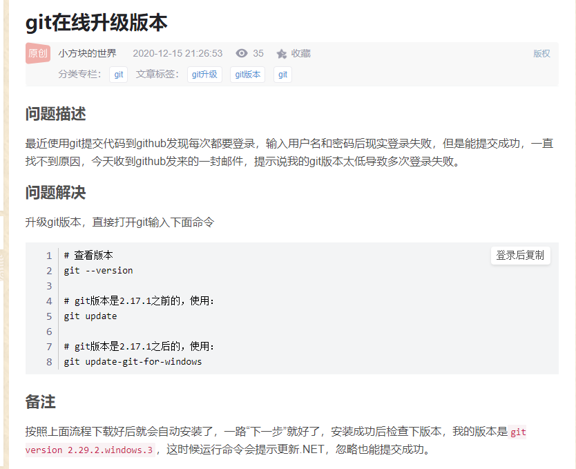

vue的生命周期 https://segmentfault.com/a/1190000011381906#comment-area

前端 一些面试题 主要讲的是问题 不是题  https://github.com/qdleader/qdleader

解决跨域文章 https://www.imooc.com/article/291931 

https://www.cnblogs.com/yalong/p/10388384.html  vue打包并且上传到npm

https://segmentfault.com/a/1190000015465173  vue的一些好的规范 命名规范

https://segmentfault.com/a/1190000015465173  js的思维导图

https://mp.weixin.qq.com/s?__biz=MzI5OTE3NDg4MQ==&mid=2247484013&idx=1&sn=6ac6f790af09f9ce801b8afe047f822a&chksm=ec9bdce3dbec55f5c62f47a79325c35369098c3f4ad54764a9e0cf5da59d928d090ab9e02782&mpshare=1&scene=23&srcid=1217GdXO2IWDvGbLxTPSZ4Ae&sharer_sharetime=1608175919627&sharer_shareid=9712db7bfd1c10fc8441818f3739b0c6#rd
h5吊起支付宝app支付 （前端实现）

vue-cli项目结构详解  https://blog.csdn.net/tanzhenyan/article/details/78871610

https://mp.weixin.qq.com/s?__biz=MzU2NTc4NjM5OQ==&mid=2247488356&idx=1&sn=0d1a57c3ffbd37128a3ce40d2ab01b35&chksm=fcb73114cbc0b80258c52e12a95e95c557281ae4e227030473441e8fad4f59031f8b8e6222e6&mpshare=1&scene=23&srcid=1224fFM0MSSonBSq0FWW1LsF&sharer_sharetime=1608773929620&sharer_shareid=e22f24a31ebc3c050a04c9a4e7f37053#rd
前端面试常问的问题

https://suozq.blog.csdn.net/article/details/96331842?utm_medium=distribute.pc_relevant.none-task-blog-BlogCommendFromBaidu-4.control&depth_1-utm_source=distribute.pc_relevant.none-task-blog-BlogCommendFromBaidu-4.control
vue-cli 3.0脚手架cli-service配置

https://mp.weixin.qq.com/s?__biz=MzU2NTc4NjM5OQ==&mid=2247488153&idx=1&sn=08e18c4e046515a0bc00cbbc45ed32d4&chksm=fcb730e9cbc0b9ff9b5b0ee56c6aed832a1bfc4649d65ba4152bd3fd44cc9ac1610edffe582d&mpshare=1&scene=23&srcid=1222TgmIjAh65Ab0YqmZZcmn&sharer_sharetime=1608630168874&sharer_shareid=e22f24a31ebc3c050a04c9a4e7f37053#rd
前端缓存

https://github.com/tigerAndBull/TABAnimated  骨架屏工具
https://github.com/Jocs/jocs.github.io/issues/22  骨架屏的说明
https://segmentfault.com/a/1190000016637877 vue 的ssr  服务端渲染一些文章
https://ssr.vuejs.org/  vue ssr 官网
https://www.liaoxuefeng.com/wiki/896043488029600 git教学

https://www.jianshu.com/p/232d540fb454  如何让别人喜欢回答你的提问

https://segmentfault.com/a/1190000009090836  vue的计数插件 自己封装的那种
https://juejin.cn/post/6910873458448531463#heading-50  vue教学 资料版

https://juejin.cn/post/6909247394904702984  vue ue教学 资料版

https://www.cnblogs.com/Nick-M/p/5559042.html  github 两台电脑公用一个仓库

https://better-scroll.github.io/docs/zh-CN/guide/base-scroll-options.html#startx  better-scroll 滑动事件

https://mp.weixin.qq.com/s?__biz=MzUxMzcxMzE5Ng==&mid=2247505180&idx=1&sn=b8a87a1ad09b049b14cbdedadfce9232&chksm=f952605fce25e9491955c677af76e86dcc2540012e8a2029134bd08df0773325e3ae32b969a8&scene=132#wechat_redirect   js小技巧

https://mp.weixin.qq.com/s?__biz=MzI2NTQ5NTE4OA==&mid=2247510347&idx=1&sn=b0583f7eef9da83766b20194f009365f&chksm=ea9e9eb0dde917a632dad1b7a6b9c78e98ddf3acf514d445be8e9296bd7b196f501388211dd7&mpshare=1&scene=23&srcid=0105i6RpZGWJzF0Ne5jUA1Wo&sharer_sharetime=1609824718890&sharer_shareid=1c071e3cdd567e234473fa1497a6b241#rd js小技巧

# https://ssr.vuejs.org/zh/#%E4%BB%80%E4%B9%88%E6%98%AF%E6%9C%8D%E5%8A%A1%E5%99%A8%E7%AB%AF%E6%B8%B2%E6%9F%93-ssr-%EF%BC%9F   vue服务端渲染 ssr 指南

https://mp.weixin.qq.com/s?__biz=MzAxODE2MjM1MA==&mid=2651566551&idx=2&sn=0b776c3dbf633a081b2eedb5dc22341a&chksm=80256616b752ef00d1873a2f95890a59110d5ec59cff259c8544493a29c4f6e9e1778c35f2ce&mpshare=1&scene=23&srcid=0108HR7bco2LJxkT38E70ICa&sharer_sharetime=1610068866844&sharer_shareid=1c071e3cdd567e234473fa1497a6b241#rd   手写promise学习

